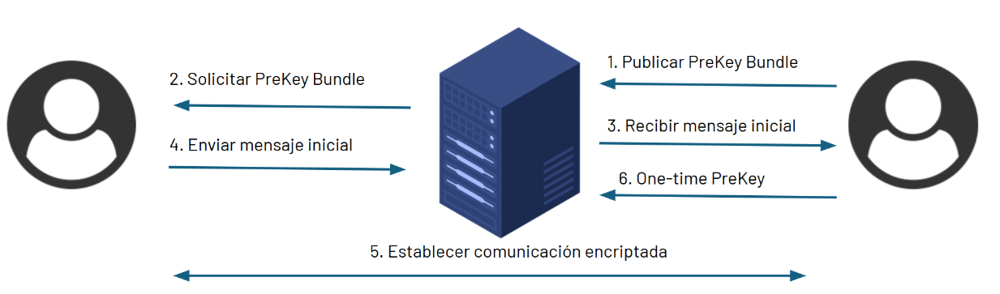

# E2EE-chat

## Integrantes
* Miguel Yurivilca
* Rodrigo Salazar

## Aplicación

Sistema de mensajería segura con cifrado E2EE basado en X3HD.

## Funcionalidades

|  ID |  CATEGORIA | REQUERIMIENTO |
|---|---|---|
| RF01 | Auth | Usuario puede crear una cuenta |
| RF02 | Auth | Usuario puede iniciar sesión a su cuenta |
| RF03 | Chat | Usuario es capaz de enviar mensaje de forma asincrónica |
| RF04 | Chat | Usuario recibe notificación en tiempo real al recibir un mensaje |
| RF05 | E2EE | Usuario es capaz de generar un par de llaves de identidad (privada y publica) |
| RF06 | E2EE | Usuario es capaz de compartir su llave de identidad pública |

## Características

### Protocolo de encriptación X3DH

El protocolo X3DH es un protocolo de acuerdo de claves que permite a dos partes establecer una clave secreta compartida a través de un canal inseguro. El protocolo X3DH se basa en el protocolo de Diffie-Hellman y utiliza una combinación de curvas elípticas y funciones hash criptográficas para garantizar la seguridad de la comunicación. 



La clave secreta compartida se utiliza para cifrar y descifrar mensajes, estableciendo un canal de comunicación E2EE seguro.


## Arquitectura actual

La arquitectura actual es una arquitectura monolítica que consta en unico servidor responsable de la gestión de usuarios y mensajes. La comunicación entre el cliente y el servidor se realiza a través de una conexión HTTPS (autenticación) y Secure WebSockets (mensajes). 

La base de datos utilizada es una base de documentos: MongoDB. Almacena la información de los usuarios, sus paquetes de llaves y los mensajes enviados.


## Arquitectura propuesta

El escalamiento de servicios con websockets es un desafío en arquitecturas monolíticas. Para resolver este problema, se propone una arquitectura serverless que permite escalar de forma horizontal los servicios de chat y autenticación.


## Pasos para ejecutar la aplicación

### Inicializar BD
```bash
docker-compose up -d
```
### Ejecutar Servidor
```bash
cd e2ee_server
go run .
```

### Ejecutar Cliente
```bash
cd e2ee_client
go run .
```


## Objetivos & Topicos Cloud
### Migración a la Nube
Transformar la arquitectura monolítica actual a un enfoque serverless, optimizado para su despliegue en la nube, mejorando escalabilidad, eficiencia y costos.

#### Topicos
* **Cloud Serverless**: Implementación de WebSockets serverless para mejorar la comunicación en tiempo real (servicio de chat)
* **Cloud Databases**: Uso de bases de datos NoSQL en la nube (DocumentDB and DynamoDB)
* **Dockerización**: Uso de imágenes Docker para la implementación de funciones Lambda

### Monitoreo y Escalabilidad
Desarrollar un sistema de autoescalado para el servicio de chat basado en WebSockets, permitiendo adaptarse automáticamente a variaciones en la carga.

#### Topicos
* **Cloud Monitoring**: Implementación de logging, alertas y estrategias de escalabilidad automatizada para mantener la operatividad y detectar problemas proactivamente.

### Misc
* **Cloud & DevOps**: Creación de un pipeline CI/CD para el despliegue continuo y automatizado de la aplicación.
* **Cloud Security**: Autenticación de usuarios mediante servicios cloud, utilizando Amazon Cognito para la gestión de identidades y acceso seguro.


## Referencias

1) The X3DH Key Agreement Protocol. (2016). Signal Messenger. https://signal.org/docs/specifications/x3dh/
2) API Gateway WebSocket APIs - Amazon API Gateway. (n.d.). https://docs.aws.amazon.com/apigateway/latest/developerguide/apigateway-websocket-api.html
3) Vishnevskiy, S. (2021, August 25). How Discord Scaled Elixir to 5,000,000 Concurrent Users. Discord. https://discord.com/blog/how-discord-scaled-elixir-to-5-000-000-concurrent-users
4) Monitor your Amazon EC2 Auto Scaling groups - Amazon EC2 Auto Scaling. (n.d.). https://docs.aws.amazon.com/autoscaling/ec2/userguide/as-monitoring-features.html
