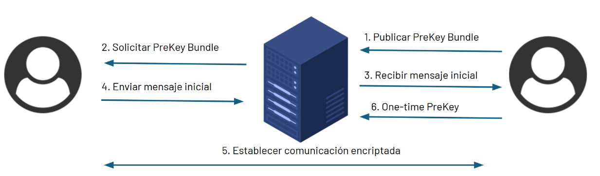
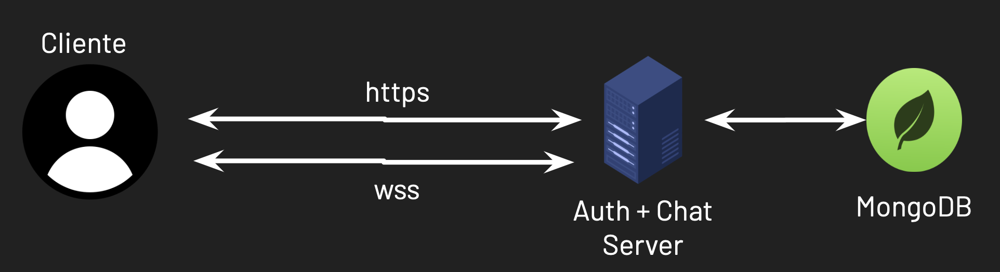
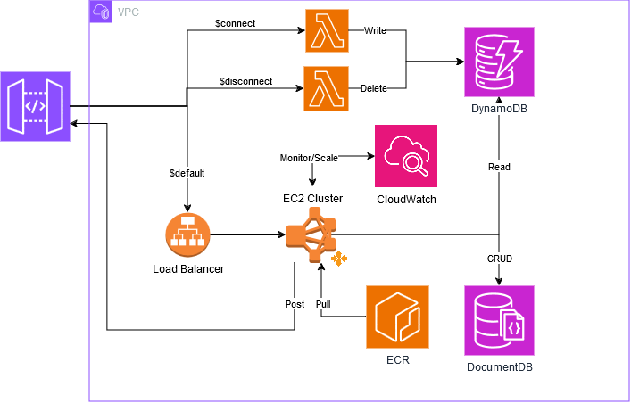

# E2EE-chat

## Integrantes
* Rodrigo Gabriel Salazar Alva
* Miguel Yurivilca


## Aplicación

Sistema de mensajería segura con cifrado E2EE basado en X3HD.

## Funcionalidades

|  ID |  CATEGORIA | REQUERIMIENTO |
|---|---|---|
| RF01 | Auth | Usuario puede crear una cuenta |
| RF02 | Auth | Usuario puede iniciar sesión a su cuenta |
| RF03 | Chat | Usuario es capaz de enviar mensaje de forma asincrónica |
| RF04 | Chat | Usuario recibe notificación en tiempo real al recibir un mensaje |
| RF05 | E2EE | Usuario es capaz de generar un par de llaves de identidad (privada y publica) |
| RF06 | E2EE | Usuario es capaz de compartir su llave de identidad pública |

## Características

### Protocolo de encriptación X3DH

El protocolo X3DH es un protocolo de acuerdo de claves que permite a dos partes establecer una clave secreta compartida a través de un canal inseguro. El protocolo X3DH se basa en el protocolo de Diffie-Hellman y utiliza una combinación de curvas elípticas y funciones hash criptográficas para garantizar la seguridad de la comunicación. 



La clave secreta compartida se utiliza para cifrar y descifrar mensajes, estableciendo un canal de comunicación E2EE seguro.


## Arquitectura actual

La arquitectura actual es una arquitectura monolítica que consta en unico servidor responsable de la gestión de usuarios y mensajes. La comunicación entre el cliente y el servidor se realiza a través de una conexión HTTPS (autenticación) y Secure WebSockets (mensajes). 

La base de datos utilizada es una base de documentos: MongoDB. Almacena la información de los usuarios, sus paquetes de llaves y los mensajes enviados.



## Arquitectura propuesta

El escalamiento de servicios con websockets es un desafío en arquitecturas monolíticas. Para resolver este problema, se propone utilizar servicios de cluster detras de un load balancer y una api gateway para gestionar las conexiones WebSocket. Esto permite desacoplar la lógica de negocio de la comunicación en tiempo real, permitiendo escalar de forma independiente.



## Pasos para desplegar la aplicación

### Lambdas
* Deployar lambda onConnect y onDisconnect

### DynamoDB
* Crear tabla `connections` con `connectionId` como primary key y un índice global secundario `username`

### API Gateway
* Crear API Gateway con WebSocket protocol
* Crear ruta `$connect` y `$disconnect` para las lambdas onConnect y onDisconnect (con la varaible de entorno `DDB_TABLE_CONN` correspondiente a la tabla de conexiones)
* Crear ruta `$default` para reenviar mensajes a ECS con plantilla de integración:
```json
{"connectionId": "$context.connectionId", "body": $input.body}
```

### ECS
* Script de despliegue en `terraform`
* Crear `secret.tfvars` con la url de conexion al API Gateway y url al container

### Mock local
* Para testear la aplicación localmente, se puede utilizar la app `mock` en la carpeta `mock`.
```bash
make mock
make backend
make client
```

### Ejecutar Cliente
Modificar el archivo `client/e2ee_client/main.go` con la uri del endpoint wss dek API Gateway y ejecutar el cliente.
```bash
make client
```

## Objetivos & Topicos Cloud
### Migración a la nube
Transformar la aquitectura monolítica (WS server) actual a un enfoque basado en contendores (HTTP server), optimizando para el despliegue en la nube, mejorando escalabilidad, eficiencia y costos.
### Bases de Datos en la Nube
Migración de bases de datos locales a bases de datos en la nube, aprovechando las ventajas de escalabilidad, disponibilidad y mantenimiento que ofrecen los servicios de bases de datos en la nube.
### Dockerización
Implementación de contenedores Docker para la aplicación, permitiendo una mayor portabilidad y flexibilidad en el despliegue de la aplicación.
### Monitoreo y Escalabilidad
Implementación de monitoreo y estrategias de escalabilidad para mantener la operatividad y eficiencia de la aplicación en la nube.

## Referencias

1) The X3DH Key Agreement Protocol. (2016). Signal Messenger. https://signal.org/docs/specifications/x3dh/
2) API Gateway WebSocket APIs - Amazon API Gateway. (n.d.). https://docs.aws.amazon.com/apigateway/latest/developerguide/apigateway-websocket-api.html
3) Vishnevskiy, S. (2021, August 25). How Discord Scaled Elixir to 5,000,000 Concurrent Users. Discord. https://discord.com/blog/how-discord-scaled-elixir-to-5-000-000-concurrent-users
4) Monitor your Amazon EC2 Auto Scaling groups - Amazon EC2 Auto Scaling. (n.d.). https://docs.aws.amazon.com/autoscaling/ec2/userguide/as-monitoring-features.html
