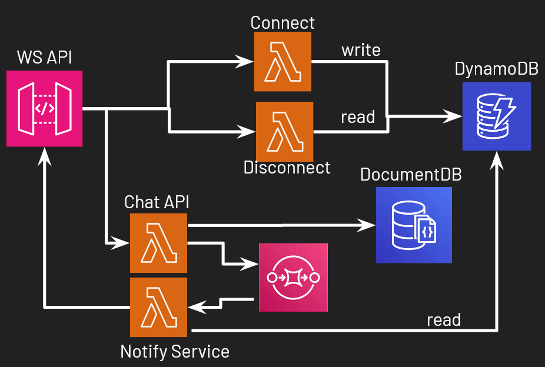

# E2EE-chat

## Integrantes
* Miguel Yurivilca
* Rodrigo Salazar

## Aplicación

Sistema de mensajería segura con cifrado E2EE basado en X3HD.

## Funcionalidades

|  ID |  CATEGORIA | REQUERIMIENTO |
|---|---|---|
| RF01 | Auth | Usuario puede crear una cuenta |
| RF02 | Auth | Usuario puede iniciar sesión a su cuenta |
| RF03 | Chat | Usuario es capaz de enviar mensaje de forma asincrónica |
| RF04 | Chat | Usuario recibe notificación en tiempo real al recibir un mensaje |
| RF05 | E2EE | Usuario es capaz de generar un par de llaves de identidad (privada y publica) |
| RF06 | E2EE | Usuario es capaz de compartir su llave de identidad pública |

## Características

### Protocolo de encriptación X3DH

* IK identifican al usuario
* OPKs permiten envío asíncrono de mensajes
* EK+OPK garantiza forward secrecy


## Arquitectura actual


## Arquitectura propuesta



## Pasos para ejecutar la aplicación

### Execute Client
```bash
cd e2ee_client
go run .
```

### Execute Server
```bash
cd e2ee_server
go run .
```

## Tópicos de cloud

* Cloud Serverless
    * Migración de la Arquitectura Monolítica a Serverless
    * Escalabilidad de WebSockets

* Cloud Databases
    * Base de datos de documentos para usar User Key Bundles
    * Base de datos de llave-valor para gestión de WebSockets

* Dockerización
    * Despliegue de lambdas con imágenes docker

* Cloud & DevOps
    * CI/CD pipeline de despliegue de aplicación

## Referencias

* The X3DH Key Agreement Protocol. (2016). Signal Messenger. https://signal.org/docs/specifications/x3dh/
* API Gateway WebSocket APIs - Amazon API Gateway. (n.d.). https://docs.aws.amazon.com/apigateway/latest/developerguide/apigateway-websocket-api.html
